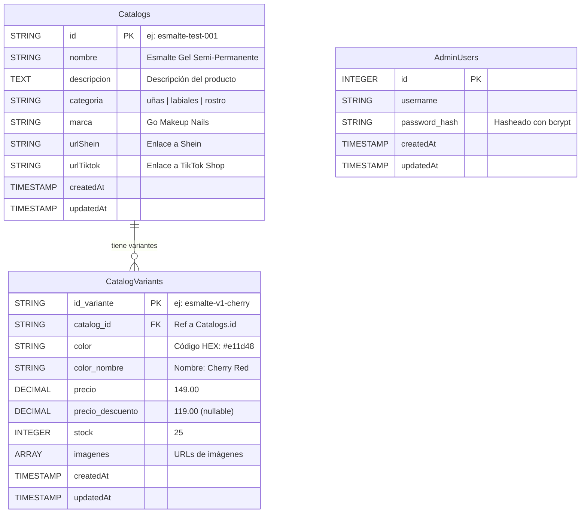
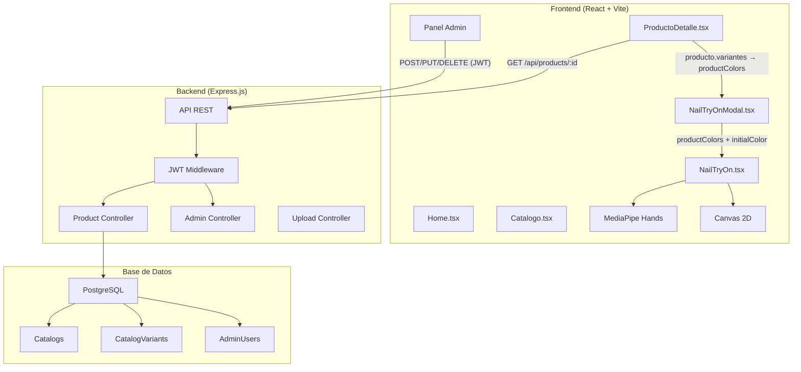
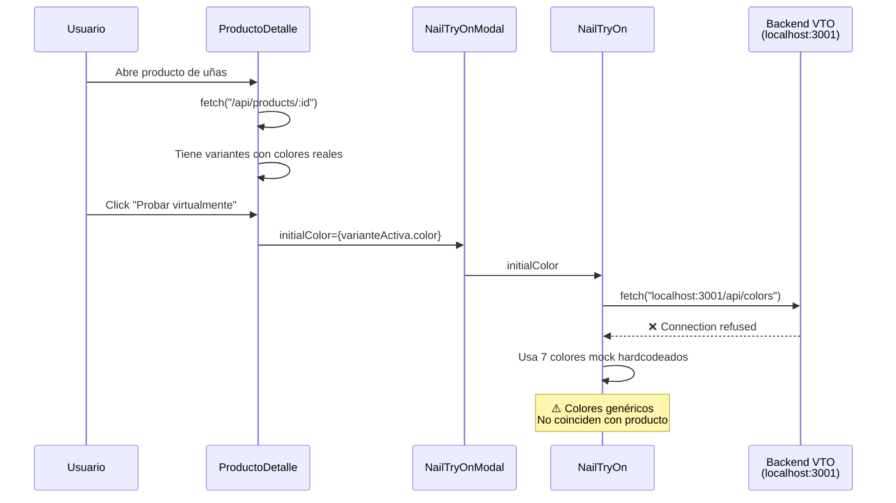
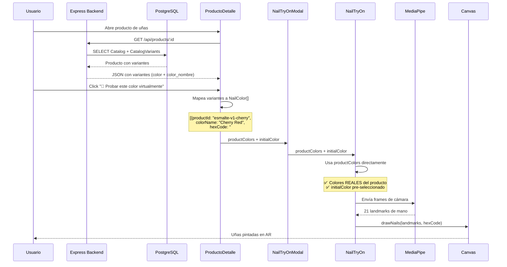
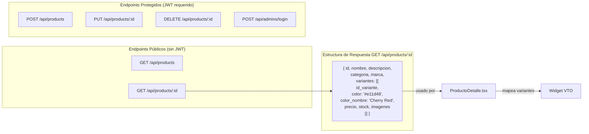
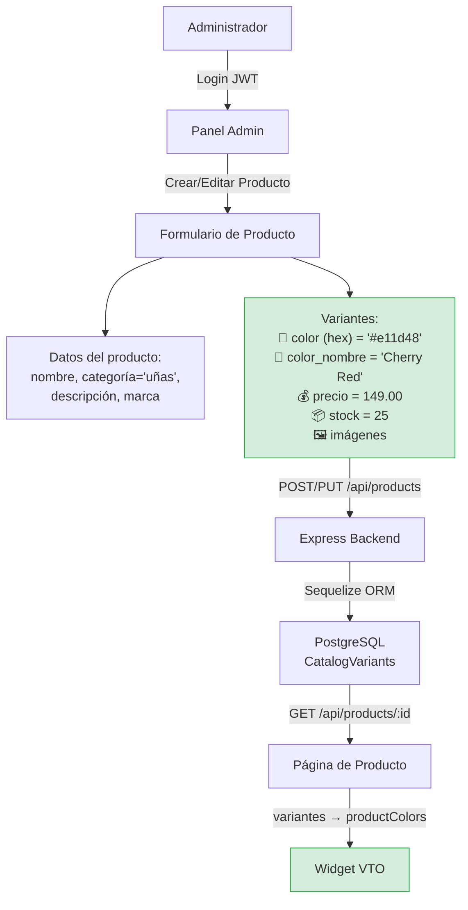
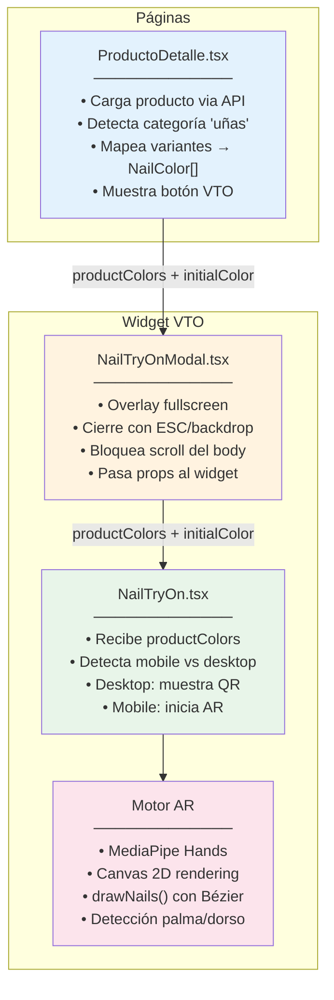
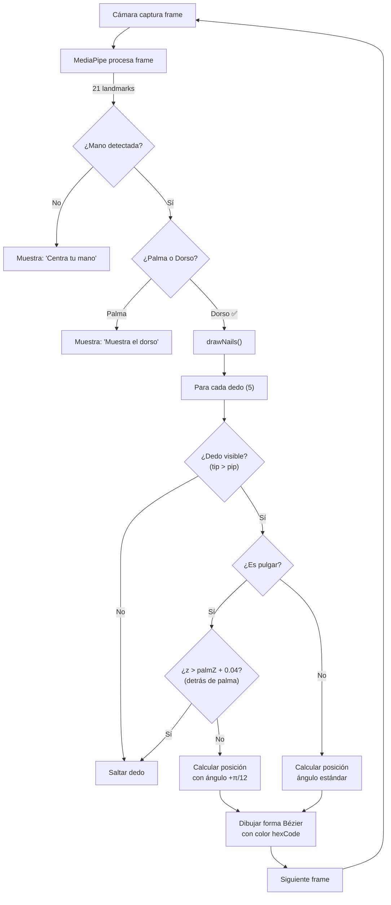
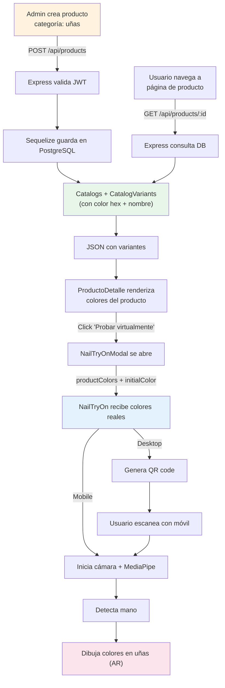
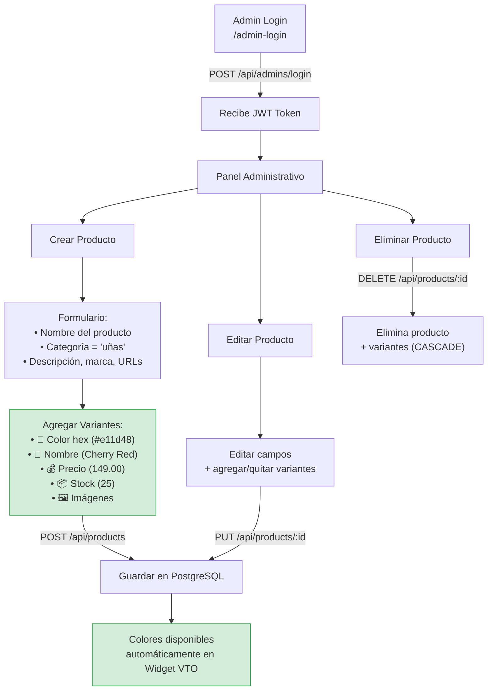

# Reporte Técnico: Integración del Probador Virtual de Uñas (VTO) con la Base de Datos del Proyecto Go Makeup

**Proyecto:** Go Makeup — Plataforma E-commerce de Cosméticos  
**Módulo:** Widget de Probador Virtual de Uñas (Virtual Try-On)  
**Fecha:** Mayo 2026  
**Versión:** 2.0 — Integración con datos reales de producto

---

## Índice

1. [Marco Teórico](#1-marco-teórico)
2. [Análisis del Sistema](#2-análisis-del-sistema)
3. [Desarrollo e Implementación](#3-desarrollo-e-implementación)
4. [Diagramas de Flujo](#4-diagramas-de-flujo)
5. [Conclusiones](#5-conclusiones)
6. [Glosario](#6-glosario)

---

## 1. Marco Teórico

### 1.1 Definición de Tecnologías

#### 1.1.1 React (v19) con TypeScript
React es una biblioteca de JavaScript para construir interfaces de usuario, desarrollada por Meta. Utiliza un modelo de componentes declarativos que permite crear UIs complejas a partir de piezas aisladas de código llamadas "componentes". TypeScript añade tipado estático a JavaScript, lo que permite detectar errores en tiempo de desarrollo y mejorar la mantenibilidad del código.

**Uso en el proyecto:** Todo el frontend de Go Makeup está construido con React + TypeScript. El widget VTO es un componente React (`NailTryOn.tsx`) que se renderiza dentro de un modal (`NailTryOnModal.tsx`) cuando el usuario accede a la página de detalle de un producto de categoría "uñas".

#### 1.1.2 Vite
Vite es una herramienta de construcción (build tool) de nueva generación para aplicaciones web. Ofrece un servidor de desarrollo extremadamente rápido con Hot Module Replacement (HMR) y un proceso de compilación optimizado basado en Rollup.

**Uso en el proyecto:** Vite sirve como el empaquetador y servidor de desarrollo del frontend de Go Makeup, proporcionando recarga instantánea durante el desarrollo y builds optimizados para producción.

#### 1.1.3 Node.js y Express.js
Node.js es un entorno de ejecución de JavaScript del lado del servidor basado en el motor V8 de Chrome. Express.js es un framework minimalista para Node.js que simplifica la creación de servidores HTTP y APIs RESTful.

**Uso en el proyecto:** El backend de Go Makeup utiliza Express.js para exponer una API REST que maneja operaciones CRUD sobre productos, variantes, usuarios administrativos y subida de archivos. El servidor corre en el puerto 5000.

#### 1.1.4 PostgreSQL con Sequelize ORM
PostgreSQL es un sistema de gestión de bases de datos relacional de código abierto, conocido por su robustez, extensibilidad y conformidad con estándares SQL. Sequelize es un ORM (Object-Relational Mapping) para Node.js que permite interactuar con bases de datos SQL usando objetos JavaScript.

**Uso en el proyecto:** PostgreSQL almacena todos los datos del catálogo de productos, incluyendo los códigos hexadecimales de color y nombres de color en la tabla `CatalogVariants`. Sequelize abstrae las consultas SQL en métodos como `findAll()`, `create()`, `update()` y `destroy()`.

#### 1.1.5 MediaPipe Hands
MediaPipe Hands es una solución de visión por computadora desarrollada por Google que permite la detección y el seguimiento de manos en tiempo real. Utiliza modelos de machine learning para identificar 21 puntos de referencia (landmarks) en cada mano detectada.

**Uso en el proyecto:** El widget VTO utiliza MediaPipe Hands para detectar la mano del usuario a través de la cámara del dispositivo. Los 21 landmarks se usan para calcular la posición, orientación y tamaño de cada uña, sobre las cuales se dibuja el color seleccionado mediante el Canvas API.

#### 1.1.6 Canvas API (HTML5)
Canvas API proporciona un medio para dibujar gráficos 2D mediante JavaScript en un elemento `<canvas>`. Permite operaciones como dibujar formas, manipular imágenes, y crear animaciones en tiempo real.

**Uso en el proyecto:** El motor de renderizado del widget (`drawNails()`) dibuja formas de uña usando curvas de Bézier sobre el feed de video en tiempo real, posicionándolas sobre los landmarks detectados por MediaPipe.

#### 1.1.7 Arquitectura REST (Representational State Transfer)
REST es un estilo arquitectónico para diseñar APIs web. Define un conjunto de restricciones para crear servicios web escalables, donde los recursos se identifican por URLs y se manipulan mediante métodos HTTP estándar (GET, POST, PUT, DELETE).

**Uso en el proyecto:** El backend expone endpoints RESTful bajo `/api/products` para operaciones CRUD. El frontend consume estos endpoints mediante `fetch()`. La integración VTO aprovecha el endpoint existente `GET /api/products/:id` que ya retorna las variantes con sus colores.

#### 1.1.8 JWT (JSON Web Tokens)
JWT es un estándar abierto (RFC 7519) para la transmisión segura de información entre partes como un objeto JSON. Se utiliza comúnmente para autenticación y autorización en APIs.

**Uso en el proyecto:** Las rutas administrativas (crear, editar, eliminar productos) están protegidas por un middleware que valida tokens JWT. Las rutas públicas de lectura (GET) no requieren autenticación, lo que permite al widget consumir datos de color sin autenticación.

---

## 2. Análisis del Sistema

### 2.1 Problema Identificado

El widget de probador virtual de uñas fue diseñado inicialmente como un módulo autónomo que intentaba obtener sus colores desde un backend VTO independiente (`localhost:3001`). Este backend nunca fue implementado, por lo que el widget caía a un conjunto de 7 colores hardcodeados ("mock colors") que no correspondían con los productos reales del catálogo.

**Consecuencias del problema:**
- Los colores mostrados en el probador no coincidían con las variantes reales del producto
- El color inicial seleccionado por el usuario en la página del producto se perdía
- No había relación entre el producto visualizado y los colores del probador
- Se requería mantener datos duplicados (colores mock vs colores de DB)

### 2.2 Análisis Comparativo de Esquemas de Base de Datos

Se analizaron dos esquemas de base de datos para determinar la fuente óptima de colores:

#### Esquema A: Base de datos externa (MySQL — `nails_db`)

| Tabla | Campos clave | Propósito |
|-------|-------------|-----------|
| `users` | id, username, password, email | Usuarios del panel externo |
| `variants` | id, user_id, name | Tipos de esmalte (Gelish, Mate) |
| `colors` | id, user_id, name, hex_code | Colores con código hexadecimal |
| `user_selections` | user_id, variant_id, color_id | Selección final del usuario |

**Limitaciones:** Los colores pertenecen a un *usuario*, no a un *producto*. No hay concepto de catálogo ni SKU. Requeriría MySQL + Flask como infraestructura adicional.

#### Esquema B: Base de datos actual (PostgreSQL — `go_makeup_db`)

| Tabla | Campos clave | Propósito |
|-------|-------------|-----------|
| `Catalogs` | id, nombre, descripcion, categoria | Productos del catálogo |
| `CatalogVariants` | id_variante, catalog_id, **color**, **color_nombre**, precio, stock | Variantes con color hexadecimal |

**Ventaja decisiva:** `CatalogVariants` ya contiene `color` (hex) y `color_nombre` — exactamente los datos que el widget necesita. Los colores están vinculados directamente a cada producto mediante `catalog_id`.

### 2.3 Decisión Técnica

Se seleccionó el **Esquema B** (base de datos actual) porque:

1. **Cero infraestructura adicional** — no se necesita MySQL, Python, ni Flask
2. **Datos ya sincronizados** — los colores son las variantes reales del producto
3. **Single source of truth** — un solo lugar donde gestionar los datos
4. **Sin latencia adicional** — no se requiere un fetch HTTP separado
5. **Gestión desde el panel existente** — los colores se administran al crear/editar productos

### 2.4 Diagrama Entidad-Relación de la Base de Datos



---

## 3. Desarrollo e Implementación

### 3.1 Arquitectura General del Sistema



### 3.2 Flujo de Datos del Widget VTO (Antes vs Después)

#### ANTES (v1 — Datos Mock)



#### DESPUÉS (v2 — Datos Reales)



### 3.3 Flujo de las APIs REST



### 3.4 Gestión desde el Panel de Control

Los colores del widget se gestionan indirectamente al administrar productos y variantes desde el panel de control de Go Makeup:



**Proceso paso a paso:**

1. El administrador inicia sesión en el panel con credenciales JWT
2. Navega a "Gestión de Productos" y crea/edita un producto
3. Establece la categoría como **"uñas"** (esto habilita el botón VTO en el PDP)
4. Agrega variantes con: código hex del color, nombre del color, precio, stock e imágenes
5. Al guardar, los datos se persisten en PostgreSQL
6. Cuando un usuario visita el PDP del producto, las variantes se cargan automáticamente
7. Al abrir el probador virtual, los colores reales de las variantes se muestran en el carrusel

### 3.5 Cambios Realizados en el Código

#### Archivo 1: `NailTryOn.tsx` (Widget Principal)

**Cambios:**
- Se exportó la interfaz `NailColor` para reutilización
- Se agregó la prop opcional `productColors?: NailColor[]`
- Se implementó lógica de prioridad: si `productColors` existe, se usa directamente sin fetch
- Se refactorizó la lógica de selección de color en función reutilizable `applyColors()`
- Se mantuvo el fallback al backend VTO y datos mock para compatibilidad

**Lógica de prioridad de datos:**
```
1. productColors (prop) → Colores reales del producto desde PostgreSQL
2. VTO Backend (fetch) → Backend externo si existe (futuro)
3. Mock colors (hardcoded) → Fallback de emergencia para desarrollo
```

#### Archivo 2: `NailTryOnModal.tsx` (Contenedor Modal)

**Cambios:**
- Se importó el tipo `NailColor` desde `NailTryOn`
- Se agregó la prop `productColors?: NailColor[]` a la interfaz
- Se pasa `productColors` al componente `NailTryOn`

#### Archivo 3: `ProductoDetalle.tsx` (Página de Detalle)

**Cambios:**
- Se mapean las variantes del producto al formato `NailColor`:
```typescript
productColors={producto.variantes.map((v) => ({
  productId: v.id_variante,
  colorName: v.color_nombre,
  hexCode: v.color,
}))}
```

### 3.6 Diagrama de Componentes Frontend



### 3.7 Motor de Renderizado AR — Flujo Interno



---

## 4. Diagramas de Flujo

### 4.1 Flujo Completo del Sistema (End-to-End)



### 4.2 Flujo de Gestión de Colores desde Panel Admin



---

## 5. Conclusiones

### 5.1 Resultado de la Integración

La integración del probador virtual de uñas con la base de datos existente de Go Makeup se completó exitosamente modificando únicamente **3 archivos** con cambios mínimos (~35 líneas de código). El widget ahora muestra los colores reales de cada producto en lugar de datos genéricos.

### 5.2 Beneficios Obtenidos

| Aspecto | Antes | Después |
|---------|-------|---------|
| Fuente de colores | Mock hardcodeado (7 colores fijos) | Variantes reales del producto (dinámicos) |
| Sincronización | Sin relación producto-color | Automática via `catalog_id` |
| Infraestructura | Requería backend VTO externo | Usa backend existente |
| Gestión de colores | No gestionable | Desde panel admin existente |
| Color inicial | Se perdía al abrir widget | Se pre-selecciona correctamente |
| Bases de datos | Necesitaría 2 (PostgreSQL + MySQL) | Solo PostgreSQL (existente) |
| Tecnologías extra | Flask + Python + MySQL | Ninguna |

### 5.3 Decisión Arquitectónica Justificada

Se descartó el camino de usar un sistema externo (Flask + MySQL) basándose en los principios de:

- **DRY (Don't Repeat Yourself):** Los datos de color ya existían en `CatalogVariants`; duplicarlos en otra base de datos viola este principio
- **KISS (Keep It Simple, Stupid):** Una solución de 35 líneas vs una nueva infraestructura completa
- **Single Source of Truth:** Un solo lugar autorizado para los datos elimina inconsistencias
- **Acoplamiento mínimo:** El widget sigue siendo independiente gracias al sistema de fallback (puede funcionar sin `productColors`)

### 5.4 Escalabilidad

La solución implementada es escalable porque:

1. **Nuevos colores** se agregan simplemente creando nuevas variantes en el panel admin
2. **Nuevos productos de uñas** automáticamente habilitan el widget VTO
3. **El fallback** al backend VTO externo se mantiene para uso futuro (si se necesita un servicio de colores centralizado)
4. **La interfaz `NailColor`** está exportada y puede ser reutilizada por otros componentes

---

## 6. Glosario

| Término | Definición |
|---------|-----------|
| **API REST** | Interfaz de programación de aplicaciones que sigue el estilo arquitectónico REST para comunicación cliente-servidor |
| **AR (Realidad Aumentada)** | Tecnología que superpone elementos virtuales sobre el mundo real capturado por una cámara |
| **Canvas API** | API de HTML5 para renderizado de gráficos 2D en el navegador |
| **CORS** | Cross-Origin Resource Sharing — mecanismo de seguridad del navegador que controla solicitudes entre dominios |
| **CRUD** | Create, Read, Update, Delete — operaciones básicas de persistencia de datos |
| **Curvas de Bézier** | Curvas paramétricas usadas en gráficos por computadora para modelar formas suaves |
| **Endpoint** | URL específica de una API que responde a solicitudes HTTP |
| **Fallback** | Mecanismo de respaldo que se activa cuando la fuente principal falla |
| **Hex Code** | Representación hexadecimal de un color (ej: #e11d48 = rojo cereza) |
| **HMR** | Hot Module Replacement — actualización de módulos en el navegador sin recargar la página |
| **JWT** | JSON Web Token — estándar para autenticación stateless mediante tokens firmados |
| **Landmark** | Punto de referencia anatómico detectado por MediaPipe en la mano (21 puntos por mano) |
| **MediaPipe** | Framework de Google para procesamiento de medios con modelos de ML en tiempo real |
| **Mock** | Datos ficticios usados durante desarrollo como sustituto de datos reales |
| **ORM** | Object-Relational Mapping — capa de abstracción entre código orientado a objetos y bases de datos relacionales |
| **PDP** | Product Detail Page — página de detalle individual de un producto |
| **Props** | Propiedades que se pasan entre componentes React para comunicación padre-hijo |
| **QR Code** | Código bidimensional que almacena información legible por cámaras |
| **Sequelize** | ORM para Node.js compatible con PostgreSQL, MySQL, SQLite y otros |
| **Single Source of Truth** | Principio donde los datos se almacenan en un único lugar autorizado |
| **TypeScript** | Superconjunto de JavaScript con tipado estático |
| **VTO** | Virtual Try-On — probador virtual que permite visualizar productos en el usuario |
| **Widget** | Componente de interfaz autónomo y reutilizable con funcionalidad específica |
