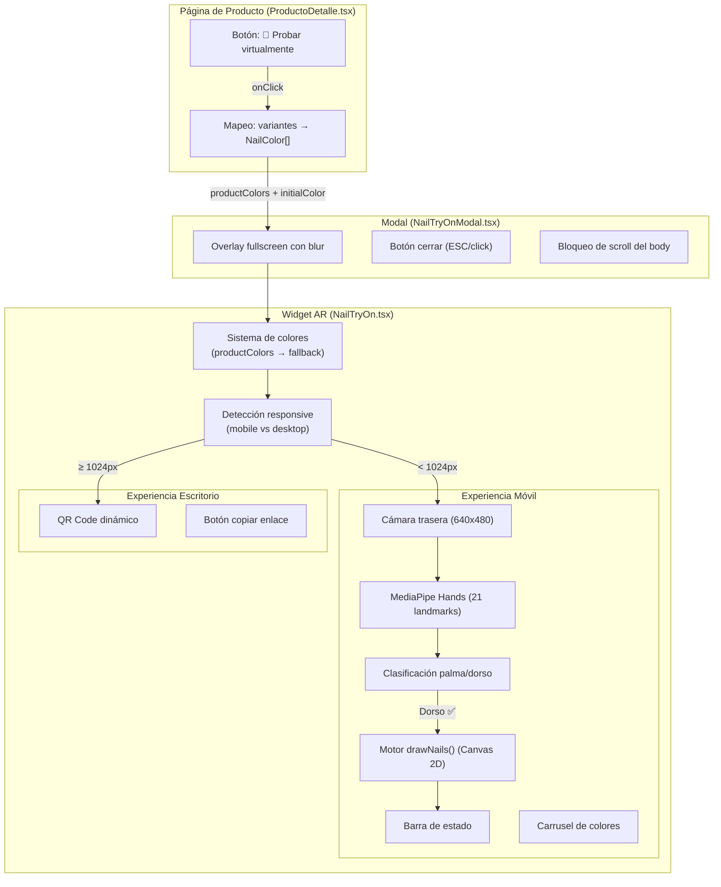
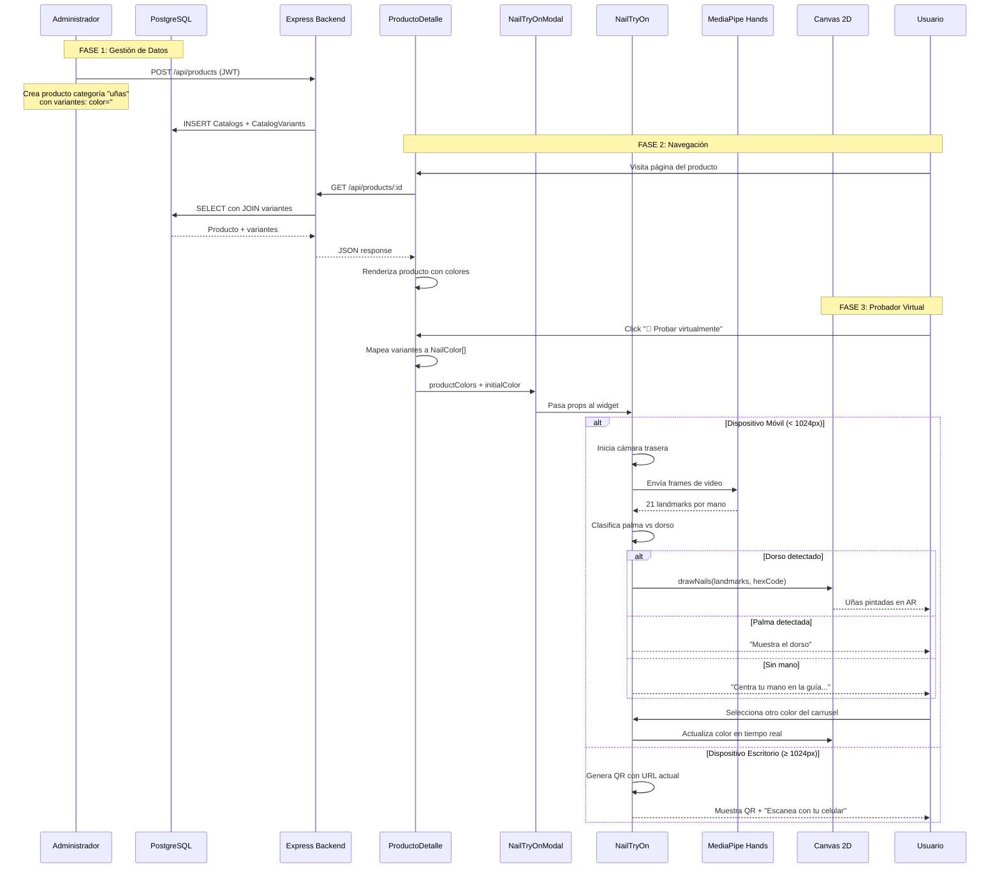
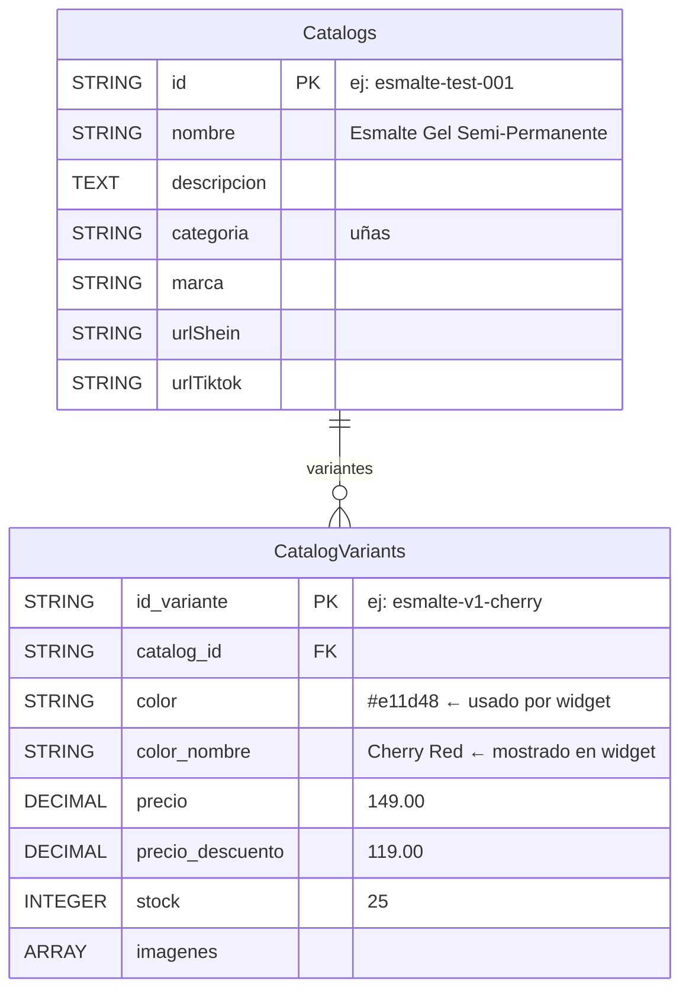
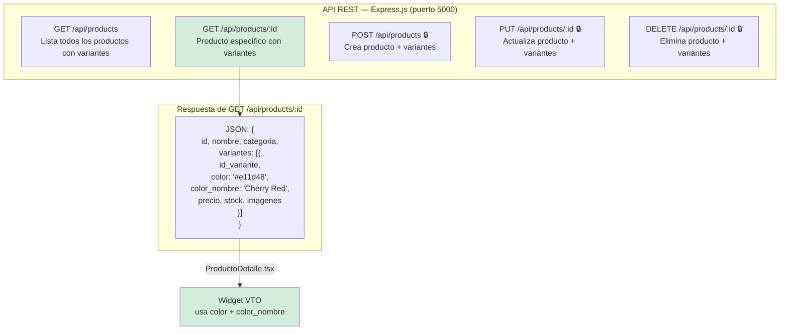
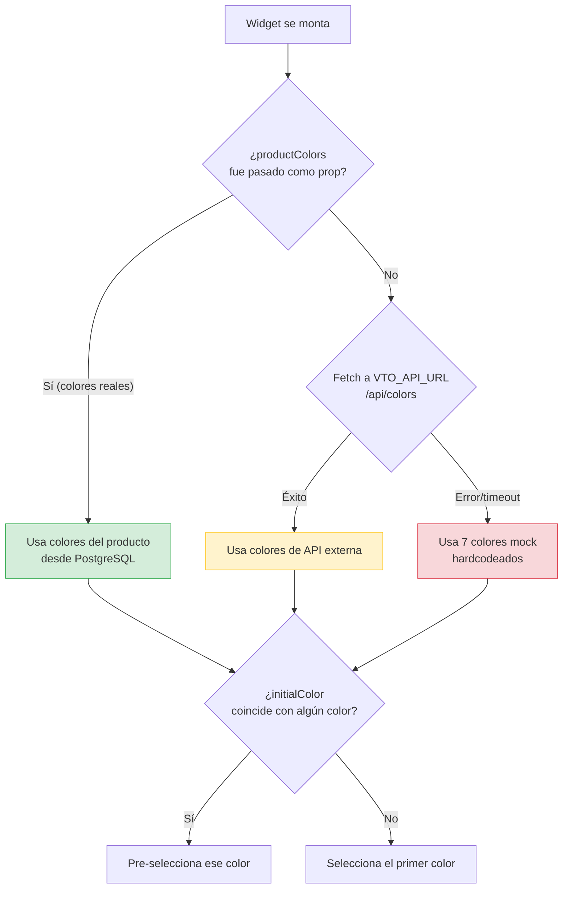
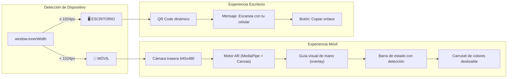
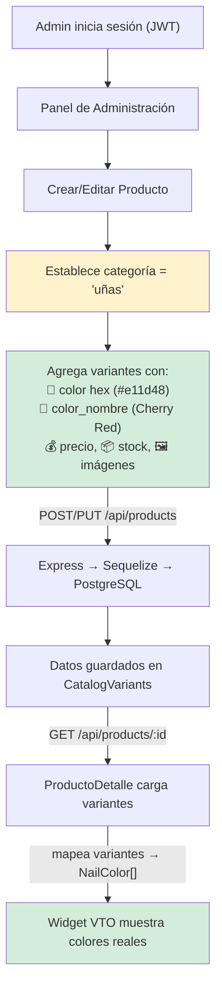
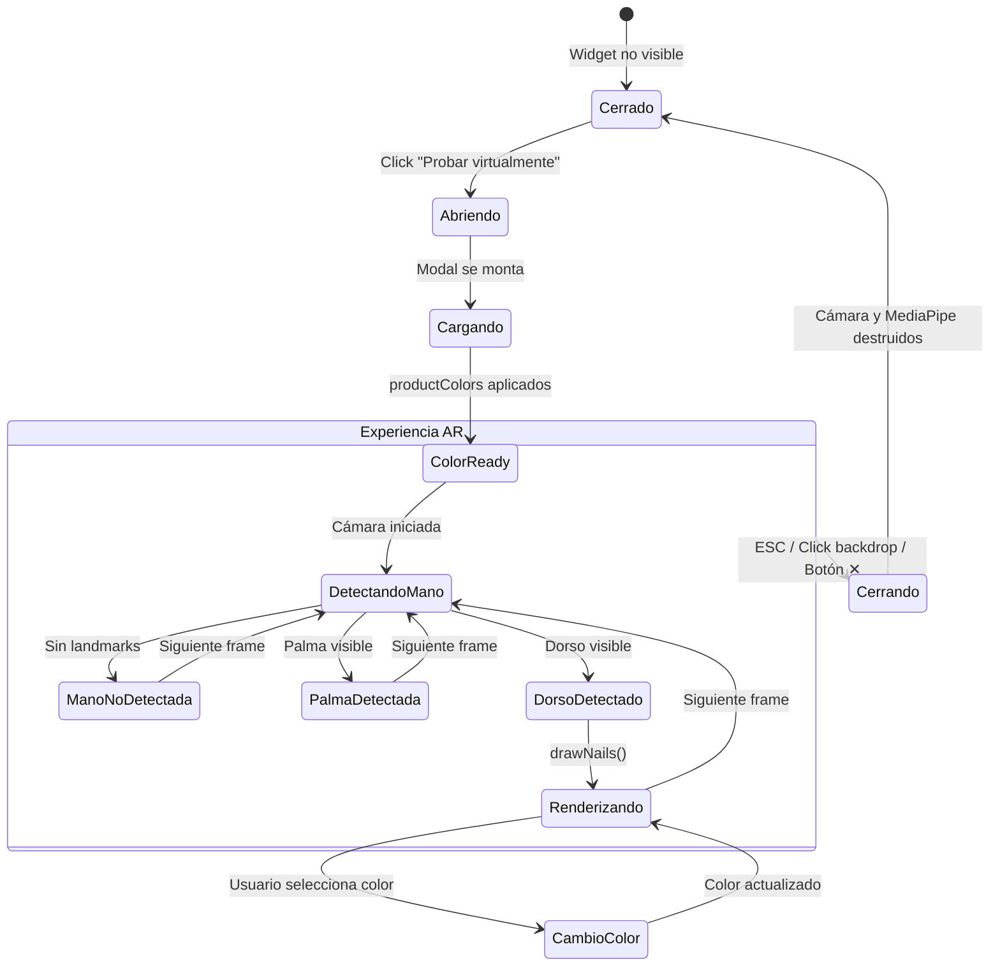

# Reporte Técnico: Probador Virtual de Uñas (Widget VTO)
## Plataforma Go Makeup — E-commerce de Cosméticos

**Fecha:** Mayo 2026 | **Versión:** 2.0

---

## Índice
1. Marco Teórico
2. Análisis
3. Desarrollo
4. Conclusiones
5. Glosario

---

## 1. Marco Teórico

### 1.1 Realidad Aumentada (AR) en E-commerce

La Realidad Aumentada es una tecnología que superpone elementos virtuales sobre el mundo real capturado por una cámara. En el contexto del comercio electrónico, permite a los usuarios "probarse" productos antes de comprarlos. Según estudios de Shopify, los productos con experiencias AR tienen una tasa de conversión un 94% mayor que los que carecen de ella.

El probador virtual de uñas (Virtual Try-On o VTO) aplica esta tecnología para permitir a las usuarias visualizar colores de esmalte sobre sus propias manos en tiempo real, reduciendo la incertidumbre de compra y las devoluciones por insatisfacción con el color.

### 1.2 Tecnologías Utilizadas

#### 1.2.1 React 19 con TypeScript
**Qué es:** Biblioteca de JavaScript para construir interfaces de usuario basada en componentes, con tipado estático mediante TypeScript.
**Para qué se usa:** Construir el widget como un componente modular (`NailTryOn.tsx`) que se integra en la página de producto sin afectar el resto de la aplicación. TypeScript garantiza que los tipos de datos (colores, landmarks, props) sean correctos en tiempo de desarrollo.
**Cómo se implementó:** El widget es un componente funcional que usa hooks (`useState`, `useEffect`, `useRef`) para manejar estado reactivo (color seleccionado, estado de la cámara, detección de mano) y referencias directas al DOM (video, canvas).

#### 1.2.2 MediaPipe Hands (Google)
**Qué es:** Solución de visión por computadora de Google que detecta y rastrea manos en tiempo real, identificando 21 puntos de referencia (landmarks) por mano.
**Para qué se usa:** Detectar la posición de cada dedo del usuario a través de la cámara del dispositivo móvil. Los 21 landmarks proporcionan coordenadas 3D (x, y, z) que permiten calcular exactamente dónde está cada uña.
**Cómo se implementó:** Se carga desde CDN (`cdn.jsdelivr.net`) con configuración de 1 mano, complejidad de modelo 1, confianza de detección 0.7 y de rastreo 0.5. Los modelos de ML se ejecutan directamente en el navegador sin servidor.

#### 1.2.3 Canvas API (HTML5)
**Qué es:** API nativa del navegador para dibujar gráficos 2D programáticamente.
**Para qué se usa:** Renderizar las formas de uña (usando curvas de Bézier) sobre el feed de video en tiempo real, posicionadas exactamente sobre los landmarks detectados por MediaPipe.
**Cómo se implementó:** La función `drawNails()` calcula para cada dedo: posición, ángulo de rotación, tamaño proporcional a la mano, y dibuja una forma de uña con dos curvas de Bézier cúbicas rellenadas con el color hexadecimal seleccionado.

#### 1.2.4 Camera Utils (MediaPipe)
**Qué es:** Utilidad de MediaPipe para acceder a la cámara del dispositivo.
**Para qué se usa:** Capturar frames de video en tiempo real y enviarlos al modelo de detección de manos.
**Cómo se implementó:** Se configura con resolución 640x480, cámara trasera (`facingMode: 'environment'`), y envía cada frame a MediaPipe Hands en un loop continuo.

#### 1.2.5 Vite
**Qué es:** Herramienta de construcción (bundler) de nueva generación.
**Para qué se usa:** Compilar TypeScript/JSX, servir el proyecto en desarrollo con HMR (recarga en caliente), y generar builds optimizados para producción.
**Cómo se implementó:** Configurado en `vite.config.ts` con el plugin de React. Las variables de entorno como `VITE_VTO_API_URL` se acceden via `import.meta.env`.

#### 1.2.6 Express.js + PostgreSQL + Sequelize
**Qué es:** Express es un framework de servidor HTTP para Node.js. PostgreSQL es un SGBD relacional. Sequelize es un ORM que mapea tablas SQL a objetos JavaScript.
**Para qué se usa:** Almacenar y servir los datos de productos y sus variantes (incluyendo códigos de color hexadecimal) mediante una API REST.
**Cómo se implementó:** El modelo `CatalogVariants` define los campos `color` (hex) y `color_nombre`. El endpoint `GET /api/products/:id` retorna el producto con todas sus variantes incluidas mediante `include: [{ model: CatalogVariant, as: 'variantes' }]`.

#### 1.2.7 QR Code API
**Qué es:** Servicio web externo (`api.qrserver.com`) para generar códigos QR dinámicos.
**Para qué se usa:** Facilitar la transición de escritorio a móvil (handoff), ya que la experiencia AR requiere cámara trasera de un dispositivo móvil.
**Cómo se implementó:** Se genera un QR con la URL actual de la página codificada, permitiendo al usuario escanear y abrir la misma página en su celular.

#### 1.2.8 CSS3 con Namespacing
**Qué es:** Hojas de estilo en cascada con prefijo `.vto-*` para evitar conflictos.
**Para qué se usa:** Estilizar el widget de forma completamente aislada del resto de Go Makeup, usando design tokens CSS, glassmorphism (backdrop-filter), animaciones (@keyframes), y diseño responsive.
**Cómo se implementó:** Todos los selectores usan prefijo `vto-`. Se definen custom properties (variables CSS) para colores, y se usan media queries para adaptación móvil.

---

## 2. Análisis

### 2.1 Objetivo del Widget

Permitir a las usuarias de Go Makeup visualizar colores de esmalte de uñas sobre sus propias manos en tiempo real usando la cámara de su dispositivo móvil, directamente desde la página de producto, sin necesidad de instalar aplicaciones adicionales.

### 2.2 Requisitos Funcionales

| ID | Requisito | Estado |
|----|-----------|--------|
| RF-01 | Detectar mano del usuario en tiempo real | ✅ Implementado |
| RF-02 | Distinguir entre palma y dorso de la mano | ✅ Implementado |
| RF-03 | Dibujar color de esmalte sobre las uñas detectadas | ✅ Implementado |
| RF-04 | Mostrar los colores reales del producto | ✅ Implementado |
| RF-05 | Permitir cambiar entre colores disponibles | ✅ Implementado |
| RF-06 | Pre-seleccionar el color elegido en la página | ✅ Implementado |
| RF-07 | Adaptarse a dispositivos móviles y escritorio | ✅ Implementado |
| RF-08 | Proveer handoff QR de escritorio a móvil | ✅ Implementado |
| RF-09 | No afectar estilos ni funcionalidad del sitio principal | ✅ Implementado |

### 2.3 Requisitos No Funcionales

| ID | Requisito | Solución |
|----|-----------|----------|
| RNF-01 | Rendimiento en tiempo real (≥15 FPS) | MediaPipe ejecuta ML en WebGL/GPU |
| RNF-02 | Sin instalación de app | Funciona 100% en navegador web |
| RNF-03 | Modularidad | Widget autocontenido en carpeta `widget/` |
| RNF-04 | Aislamiento de estilos | Namespacing CSS `.vto-*` |
| RNF-05 | Fallback graceful | Si no hay datos de producto, usa colores mock |

### 2.4 Arquitectura de Componentes



### 2.5 Flujo de Datos Completo



### 2.6 Esquema de Base de Datos Relevante



### 2.7 Diagrama de la API REST



---

## 3. Desarrollo

### 3.1 Estructura de Archivos del Widget

```
src/
├── components/
│   └── widget/                    # Módulo VTO autocontenido
│       ├── NailTryOn.tsx          # Componente principal (365 líneas)
│       ├── NailTryOn.css          # Estilos aislados (286 líneas)
│       ├── NailTryOnModal.tsx     # Contenedor modal (52 líneas)
│       └── NailTryOnModal.css     # Estilos del modal (101 líneas)
├── config/
│   └── vto.ts                    # Configuración de URL del backend VTO
├── pages/
│   └── ProductoDetalle/
│       └── ProductoDetalle.tsx    # Página que invoca el widget
backend/
├── models/
│   ├── Catalog.js                # Modelo de producto
│   └── CatalogVariant.js         # Modelo de variante (color, precio)
├── routes/
│   └── productRoutes.js          # Endpoints CRUD
├── config/
│   └── db.js                     # Conexión PostgreSQL
└── server.js                     # Servidor Express
```

### 3.2 Implementación del Motor de Renderizado AR

La función `drawNails()` es el núcleo del renderizado AR. Su algoritmo:

**Entrada:** Contexto Canvas 2D, 21 landmarks, dimensiones del canvas, color hex.

**Paso 1 — Cálculo de escala:**
Se mide la distancia entre la muñeca (landmark 0) y el MCP del dedo medio (landmark 9) para calcular un `scaleFactor` proporcional al tamaño real de la mano.

**Paso 2 — Iteración por dedo:**
Para cada uno de los 5 dedos (pulgar=4, índice=8, medio=12, anular=16, meñique=20):

**Paso 3 — Verificación de visibilidad:**
Se compara la distancia tip-muñeca vs pip-muñeca. Si el tip está más cerca que el pip, el dedo está doblado y se omite.

**Paso 4 — Filtro del pulgar:**
Para el pulgar (landmark 4), se verifica la coordenada Z. Si `thumbZ > palmZ + 0.04`, el pulgar está detrás de la palma y se omite.

**Paso 5 — Cálculo de posición y ángulo:**
```
x, y = tip.x * width, tip.y * height    // Posición del tip
px, py = prev.x * width, prev.y * height // Posición anterior
angle = atan2(y - py, x - px)            // Ángulo del dedo
// Para el pulgar: angle += π/12 (corrección de 15°)
```

**Paso 6 — Posicionamiento de cutícula:**
Se retrocede un 25% desde el tip hacia el segmento anterior para posicionar el inicio de la uña en la cutícula.

**Paso 7 — Dibujo con Bézier:**
```
tipExtension = radiusX * 2.6
ctx.moveTo(0, 0)  // Cutícula
ctx.bezierCurveTo(0, rY*1.5, rX*1.2, rY*1.1, tipExtension, 0)  // Lado superior
ctx.bezierCurveTo(rX*1.2, -rY*1.1, 0, -rY*1.5, 0, 0)           // Lado inferior
ctx.fill()  // Rellenar con el color hex seleccionado
```

### 3.3 Clasificación Palma vs Dorso

El sistema distingue entre palma y dorso usando producto cruz vectorial:

```
v1 = landmark[5] - landmark[0]   // Vector muñeca→índice_MCP
v2 = landmark[17] - landmark[0]  // Vector muñeca→meñique_MCP
crossZ = v1.x * v2.y - v1.y * v2.x
```

Para mano izquierda: `crossZ < 0` = Palma, `crossZ > 0` = Dorso.
Para mano derecha: `crossZ > 0` = Palma, `crossZ < 0` = Dorso.

El esmalte solo se dibuja cuando se detecta el dorso, ya que es la vista natural donde las uñas son visibles.

### 3.4 Sistema de Prioridad de Colores



### 3.5 Sistema Responsive (Mobile vs Desktop)



### 3.6 Gestión de Colores desde el Panel Admin

Los colores del widget se gestionan desde el panel de administración existente de Go Makeup al crear o editar productos:



**Flujo paso a paso:**
1. El administrador accede al panel con credenciales protegidas por JWT
2. Crea o edita un producto estableciendo la categoría como **"uñas"**
3. Agrega variantes donde cada una tiene un **código hexadecimal** y un **nombre de color**
4. Al guardar, Sequelize inserta los datos en la tabla `CatalogVariants` de PostgreSQL
5. Cuando un usuario visita la página del producto, el frontend hace `GET /api/products/:id`
6. La respuesta JSON incluye las variantes con `color` y `color_nombre`
7. `ProductoDetalle.tsx` mapea las variantes al formato `NailColor[]` del widget
8. El widget muestra los colores reales en el carrusel y permite probarlos en AR

### 3.7 Ciclo de Vida del Widget



---

## 4. Conclusiones

### 4.1 Logros Técnicos

1. **Probador virtual funcional en navegador:** Se logró implementar detección de manos y renderizado de esmalte en tiempo real usando exclusivamente tecnologías web (sin app nativa).

2. **Integración con datos reales:** El widget consume los colores directamente desde la base de datos PostgreSQL del proyecto, eliminando la necesidad de datos ficticios o sistemas externos.

3. **Modularidad total:** El widget está autocontenido en 4 archivos con estilos aislados mediante namespacing CSS, garantizando zero impacto en la aplicación principal.

4. **Experiencia adaptativa:** El sistema detecta automáticamente el dispositivo y ofrece la experiencia AR en móvil o el handoff via QR en escritorio.

5. **Gestión centralizada:** Los colores se administran desde el mismo panel de control donde se gestionan los productos, manteniendo una única fuente de verdad.

### 4.2 Tecnologías Clave y su Aporte

| Tecnología | Aporte al Widget |
|------------|-----------------|
| MediaPipe Hands | Detección de manos en tiempo real con ML en el navegador |
| Canvas API | Renderizado de formas de uña con curvas de Bézier |
| React + TypeScript | Componentes tipados, estado reactivo, ciclo de vida controlado |
| PostgreSQL + Sequelize | Persistencia de colores vinculados a productos |
| Express.js REST API | Comunicación frontend-backend para obtener datos de color |
| CSS3 Namespaced | Estilos aislados, responsive, con animaciones |
| QR Code API | Transición escritorio a móvil para experiencia AR |

### 4.3 Ventajas de la Implementación

- **Sin dependencias de servidor externo:** Todo funciona con la infraestructura existente de Go Makeup
- **Rendimiento:** MediaPipe ejecuta los modelos de ML directamente en la GPU del dispositivo via WebGL
- **Escalabilidad:** Agregar nuevos colores solo requiere crear variantes desde el panel admin
- **Mantenibilidad:** 4 archivos, ~800 líneas totales, completamente desacoplados del sitio principal

---

## 5. Glosario

| Término | Definición |
|---------|-----------|
| AR | Augmented Reality — tecnología que superpone elementos virtuales sobre el mundo real |
| Bézier (curva) | Curva paramétrica usada en gráficos por computadora para modelar formas suaves |
| Canvas API | API de HTML5 para dibujar gráficos 2D programáticamente en el navegador |
| CDN | Content Delivery Network — red de servidores para distribuir archivos estáticos |
| CRUD | Create, Read, Update, Delete — operaciones básicas de persistencia de datos |
| Fallback | Mecanismo de respaldo cuando la fuente de datos principal no está disponible |
| Handoff | Transferencia de una experiencia de un dispositivo a otro (ej: desktop a móvil) |
| Hex Code | Código hexadecimal que representa un color (ej: #e11d48 = rojo cereza) |
| Hook (React) | Funciones que permiten usar estado y ciclo de vida en componentes funcionales |
| JWT | JSON Web Token — estándar para autenticación sin estado mediante tokens firmados |
| Landmark | Punto de referencia anatómico (21 por mano) detectado por MediaPipe |
| MediaPipe | Framework de Google para procesamiento de medios con modelos de ML en tiempo real |
| ML | Machine Learning — algoritmos que aprenden patrones a partir de datos |
| Namespacing | Técnica de prefijo en selectores CSS para evitar conflictos entre componentes |
| ORM | Object-Relational Mapping — abstracción entre objetos de código y tablas de BD |
| PDP | Product Detail Page — página individual de detalle de un producto |
| Props | Propiedades pasadas entre componentes React (comunicación padre→hijo) |
| QR Code | Código bidimensional legible por cámaras que almacena información (URLs, texto) |
| Ref (React) | Referencia mutable que persiste entre re-renders, usada para acceder al DOM |
| REST | Representational State Transfer — estilo arquitectónico para APIs web |
| Sequelize | ORM para Node.js compatible con PostgreSQL, MySQL, SQLite |
| TypeScript | Superconjunto de JavaScript con sistema de tipos estático |
| VTO | Virtual Try-On — probador virtual que permite visualizar productos sobre el usuario |
| WebGL | API de gráficos 3D del navegador, usada por MediaPipe para ejecutar ML en GPU |
| Widget | Componente de UI autónomo con funcionalidad específica y reutilizable |
